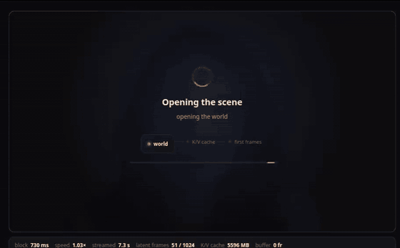
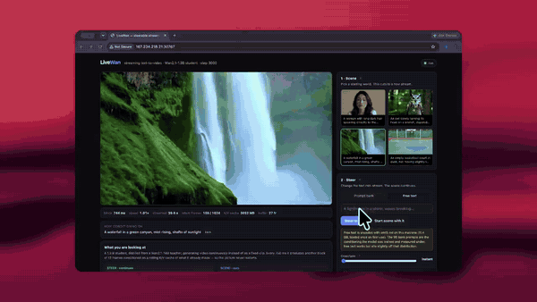
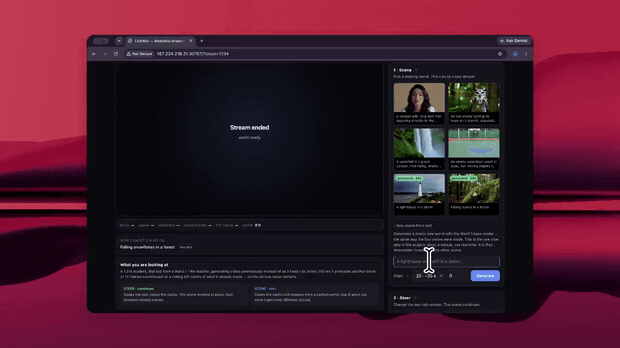
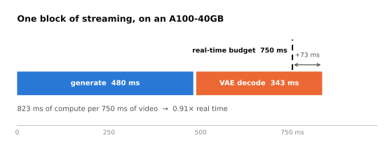
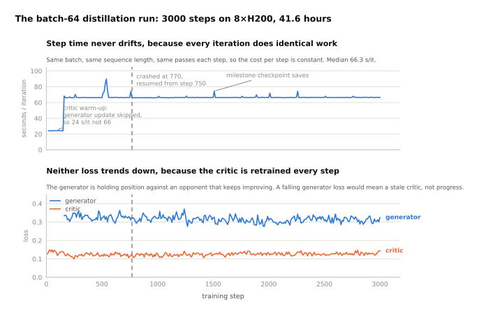
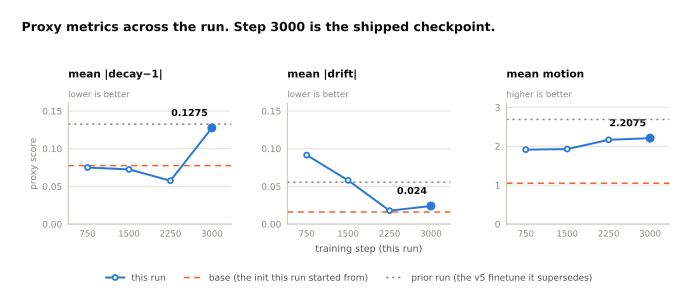

# LiveWan

<p>
<a href="https://huggingface.co/spaces/JonathanColetti/LiveWan">
<picture>
<source media="(prefers-color-scheme: dark)" srcset="https://huggingface.co/datasets/huggingface/badges/resolve/main/open-in-hf-spaces-md-dark.svg">

</picture>
</a>
<a href="https://huggingface.co/JonathanColetti/LiveWan">
<picture>
<source media="(prefers-color-scheme: dark)" srcset="https://huggingface.co/datasets/huggingface/badges/resolve/main/model-on-hf-md-dark.svg">

</picture>
</a>
</p>

Streaming text-to-video you can steer while it runs.

A 1.3 B student, distilled from a Wan2.1-T2V-14B teacher, that generates video
continuously rather than as a fixed clip: 750 ms of 640×368 at a time, extended
block by block for as long as you let it run. The text conditioning can be swapped
mid-stream without clearing the K/V cache, so the scene continues instead of cutting.

Weights and data: [JonathanColetti/LiveWan](https://huggingface.co/JonathanColetti/LiveWan).

## See it run

Check out the free demo:
[Spaces](https://huggingface.co/spaces/JonathanColetti/LiveWan)


Three screen recordings of the browser demo on an A100-40GB. The previews below are sped
up and silent; each one links to the full-speed video.

### Four minutes in one take

[](docs/media/long-run.mp4)

**[Full video — 4 min 43 s, real time](docs/media/long-run.mp4)** · preview above is 40× speed

One stream, opened once and never restarted. The HUD along the bottom is the thing to
watch: block time and K/V cache hold steady while latent frames climbs, because the
event window is bounded and only the frame counter grows. The stream ends by stopping
itself:

> stream reached the 1024-latent-frame RoPE ceiling which needs to start a new stream

That is the documented limit - `WanModel.freqs` only carries tables for 1024 latent frames, about 4.3 minutes (see
[How the streaming works](#how-the-streaming-works)). The picture is still holding
together when it gets there.

### Steering mid stream

[](docs/media/steer-waterfall-to-lighthouse.mp4)

**[Full video — 27 s](docs/media/steer-waterfall-to-lighthouse.mp4)** · preview above is 3× speed

A waterfall in a green canyon, steered to the free text `A lighthouse in a storm` while it
runs. The counters show the mechanism doing what it claims: `latent frames` runs straight
through the steer instead of resetting, and the `K/V cache` figure does not move. Nothing
reloaded. The same stream simply changed what it was being told.

It is also the honest version of the caveat below in [The demo](#the-demo). Canyon =>
lighthouse is a cross theme steer, and it does not resolve cleanly: a tower and a horizon
do assemble out of the old scene, but they arrive dragging green residue and vertical
streaking from a K/V cache still full of waterfall. This is the failure the UI warns you
about before you commit to it, and more denoising steps do not fix it. When you want a
genuinely different picture, cut a new scene instead — which is what the next clip does.

### A new world from a prompt

[](docs/media/new-scene-from-text.mp4)

**[Full video — 26 s](docs/media/new-scene-from-text.mp4)** · preview above is 3× speed

`A penguin sliding on snow` → **Generate**, at 20 steps. The Wan2.1 base model builds a
fresh 21-frame opening world (~35 s — the one part of the project that is not real time),
it lands in the picker with a `generated` badge, and the 1.3B student takes over and
extends it at 1× for as long as you leave it running. The four shipped worlds are not
special; this is exactly how they were made. Details in
[New scenes from text](#new-scenes-from-text).

## Setup

**Prerequisites:** Linux, Python ≥ 3.10, `git`, an NVIDIA GPU with >= 12 GB VRAM and
compute capability >= 8.0 (Ampere or newer — bf16 is required), and 12-29 GB of free
disk depending on which optional pieces you want. See [Minimum spec](#minimum-spec).

```bash
git clone https://github.com/JonathanColetti/LiveWan && cd LiveWan
python -m venv .venv && source .venv/bin/activate

# 1. torch first, matching YOUR GPU this is the one line to get right.
#    cu128 suits most cards; Blackwell (RTX 50xx, B200) needs cu128 or newer.
pip install torch torchvision --index-url https://download.pytorch.org/whl/cu128

# 2. the package, which also brings in the `hf` CLI that step 3 needs
pip install -e .

# 3. weights: ~12 GB minimum, ~29 GB with everything. Checksum-verified.
./setup.sh

# 4. run it
livewan-serve
```

Then open **http://localhost:17070/?token=1234** (the token is required; see
[Access](#access) to change or disable it).

First start takes about 90 seconds: ~2.6 GB of weights load and the VAE decoder is
`torch.compile`d once. The UI shows staged progress throughout. Pass `--no-compile` to
skip the compile at a cost of ~50 ms per block.

`setup.sh` downloads into the repository directory and the defaults resolve there, so
a fresh clone runs with no arguments. Point elsewhere with `--assets` / `--base-dir` /
`--wan-repo` / `--worlds-dir`, or the matching `LIVEWAN_ASSETS`, `LIVEWAN_BASE_DIR`,
`LIVEWAN_WAN_REPO`, `LIVEWAN_WORLDS_DIR` environment variables.

Two optional downloads can be skipped:

```bash
SKIP_T5=1  ./setup.sh    # -11 GB: no free text prompts, the 96 prompt bank still works
SKIP_BASE=1 ./setup.sh   # -5.7 GB: cannot generate new worlds (pair with --no-worldgen)
```

To reproduce the exact environment behind the numbers in this README, use
`requirements-lock.txt` instead of the looser bounds in `pyproject.toml`:

```bash
pip install torch==2.12.0 torchvision==0.27.0 --index-url https://download.pytorch.org/whl/cu130
pip install -r requirements-lock.txt
pip install -e . --no-deps
```

### If something goes wrong

| symptom | cause |
|---|---|
| `no kernel image is available for execution` | the torch wheel predates your GPU — reinstall from a newer CUDA index |
| `CUDA out of memory` at startup | something else holds the GPU, or you need `--window 4` (see Minimum spec) |
| `FileNotFoundError: .../Wan2.1_VAE.pth` | `setup.sh` did not finish, or `--base-dir` points elsewhere |
| `world generation is unavailable` | the 5.7 GB base transformer is missing — re-run without `SKIP_BASE=1` |
| free text fails, bank prompts work | umt5-xxl is missing — re-run without `SKIP_T5=1` |
| `401 unauthorized` | append `?token=1234`, or whatever `--token` you set |

## What is here

The full project: the streaming inference core, the SF-DMD trainer that produced the
checkpoint, the evaluation and benchmarking scripts, and a browser demo.

| | |
|---|---|
| `wanstreamer/` | the inference core — block-causal attention, K/V cache, RoPE, the few-step streamer. This is the code the checkpoint was distilled and measured under |
| `wanstreamer/serve/` | the browser demo layer built on top of it |
| `scripts/train_dmd.py`, `scripts/run/run_b64_resume.sh` | the trainer and the resume wrapper the [model card](https://huggingface.co/JonathanColetti/LiveWan) describes |
| `scripts/`, `tools/` | evaluation, benchmarking, verification, teacher generation, prompt encoding |
| `scripts/run/`, `scripts/eval/` | the shell wrappers from the original run — launch, resume, evaluate, watchdog |
| `docs/` | HANDOFF, STATUS, START_HERE and the 16-GPU run notes from the original run |

Not included: the Wan2.1-T2V-14B teacher (needed only for distillation, and fetched
separately), and the training *data* — `scripts/gen_teacher.py` regenerates it.

## Minimum spec

Measured on this box (A100 40GB, torch 2.12 + cu130, bf16), not estimated.

| | minimum | comfortable |
|---|---|---|
| **GPU** | 12 GB VRAM, compute capability ≥ 8.0 (Ampere) | 16 GB, or 40 GB if you want free-text prompts |
| **VRAM, bank prompts only** | 10.3 GB peak allocated / 14.5 GB reserved at `--window 6` | — |
| **VRAM, with free text** | +11.4 GB while umt5-xxl is resident (~26 GB total) | 40 GB |
| **VRAM, generating worlds** | 13.0 GB peak with the base model resident (+2.6 GB), before umt5 | 16 GB |
| **Disk** | ~12 GB (checkpoint + prompt bank + worlds + VAE) | ~29 GB for everything: +5.7 GB base transformer (new worlds), +11 GB umt5-xxl (free text) |
| **Compute** | anything slower than an A100 streams below real time, proportionally | A100/H100 for ~1× |
| **CPU / RAM** | 4 cores, 16 GB - JPEG encoding is 1.5 ms/frame, nothing else is hot | |
| **Network** | ~6 Mbit/s per viewer at `--jpeg-quality 85` | lower the quality for remote viewers |

Tight on VRAM? `--window 4` drops reserved to 11.0 GB and `--window 2` to 9.7 GB, at the
cost of a shorter attention history (the model was trained at window 6). Two features are
independently skippable: `SKIP_T5=1 ./setup.sh` / free text (11 GB), and `SKIP_BASE=1
./setup.sh` + `--no-worldgen` / generating new worlds (5.7 GB). Skip both and the demo
still streams all four shipped worlds with the 96-prompt bank in ~12 GB of disk.

bf16 is required as written (the student is run in bf16 with fp32 modulation), which is
what sets the Ampere floor. Nothing here needs flash-attn — attention is plain SDPA.

## The demo

Two controls, which do genuinely different things:

| | what it does | cost |
|---|---|---|
| **Steer** | swaps the cross-attention conditioning, **keeps** the K/V cache — the scene morphs in place | free, instant |
| **Scene** | clears the cache and reopens from another cached world — a cut | ~4 s reload |

Steering is the interesting one, and it has a grain to it. Moving between related
scenes (`waterfall → mountain stream`) evolves the picture beautifully: a pool and
rocks grow in while the shot stays photographic. Moving somewhere unrelated
(`green canyon at noon → aurora at night`) asks the model to reconcile a K/V cache
full of daylight with a night-time prompt, and it smears. The UI warns you when
you cross themes; the crossfade slider softens it; more denoising steps do **not**
fix it. If you want a genuinely different picture, cut to a new scene.
[Watch a cross-theme steer smear](#steering-mid-stream-and-where-it-breaks) rather than
taking the warning on faith.

Prompts come from either the 96-prompt bank (`data/prompts.pt` — the exact
conditioning the model was trained and measured under) or free text, encoded here
with umt5-xxl. Free text works, with the caveat in `docs/NOTES.md`.

One thing the UI has to be explicit about: **a prompt cannot produce the opening
frames.** Every stream starts from a world's 21 latent frames, so free text
conditions what happens *next* rather than creating the picture. The free-text tab
therefore carries its own "Opens from" world picker rather than quietly reusing
whichever scene happened to be selected — otherwise typing "lighthouse", getting
world 60, and watching a waterfall reads as the text having been ignored.

### New scenes from text

You are not limited to the four shipped worlds. They are not special. They are just
21 latent frames the base model generated once and someone cached (`base_seconds` in
each file is literally how long it took). **Scene => New scene from text** makes another
one from any prompt ([watch one being made](#a-new-world-from-a-prompt)):

```bash
curl -X POST 'localhost:17070/api/world/new?token=1234' \
  -H 'Content-Type: application/json' \
  -d '{"prompt_text":"a lighthouse on a cliff in a storm","steps":30}'
```

| steps | time (A100-40GB) | |
|---|---|---|
| 20 | ~35 s | already good |
| 30 | ~52 s | default |
| 50 | ~87 s | a little more detail |

This is the one part of the project that is not real time, and it is the base (wan)
model doing it. full bidirectional attention over all 21 frames, CFG, a real 30-step
schedule. The student then extends the result forever at 1×. Generated worlds are
written to `--worlds-dir`, survive a restart, appear in the picker with a `generated`
badge, and can be deleted from the UI.

The prompt's embedding is stored alongside the world, so reopening one needs no text
encoder at all. It reuses the exact conditioning it was generated under. World
generation itself works from a bank index too (`{"prompt_idx": 67}`), which needs no
umt5 either. Only free text does.

Skip it with `--no-worldgen` (saves 2.6 GB VRAM) or `SKIP_BASE=1 ./setup.sh` (saves the
5.7 GB download).

### Look (post-processing)

Sharpen / contrast / saturation / brightness, with four presets and a hold-to-compare
button. It runs in the browser compositor. an unsharp `feConvolveMatrix` plus CSS
filter functions on the canvas — so per-frame JS cost is zero and the stream stays at
1×. Doing the same work on the GPU that is generating frames would cost roughly a
quarter of the frame budget and drop the stream below real time.

It is display only: it changes what you see, not what the model produced. That makes it
the right tool for the softness long streams drift into, and the wrong tool for
anything you intend to measure.

### Access

The server carries its own shared-token gate, covering HTTP *and* the websocket
(Starlettes HTTP middleware never sees websocket scopes, so this is a plain ASGI
wrapper see `wanstreamer/auth.py`):

```bash
livewan-serve --token 1234     # default; open /?token=1234
livewan-serve --token ""       # no auth at all
```

A token in the query string is echoed back as a cookie, so `/?token=…` once is enough.
**A short token is a short token**. On a public IP it is effectively an open GPU. Use a
long one, or leave the demo behind whatever reverse proxy your host already provides.

## Layout

```
wanstreamer/              the inference core (imported as `wanstreamer`)
  blockcausal.py   block-causal attention with an explicit K/V buffer
  kvcache.py       the streaming cache: append, evict-front, pinned prefix
  rope.py          RoPE tables with absolute frame indices and gap support
  stream.py        FewStepStreamer ( the rollout loop the student is run under)
  core.py          shared forwards, geometry, modulation cache
  pipeline.py      the higher-level world/event pipeline
  dmd.py, fsdp.py, lora.py, data.py, metrics.py, prompts*.py, text.py, graphrunner.py
  serve/                  the browser demo (a shell over the core)
    engine.py      sessions, threading, backpressure, JPEG framing
    server.py      FastAPI + WebSocket    -> livewan-serve
    worldgen.py    base-model text -> a new 21-frame opening world
    streamdecode.py  VAE decoding that survives across blocks
    conditioning.py  the 96-prompt bank + lazy umt5-xxl
    auth.py, paths.py, web/index.html
setup.sh                  fetches the weights ( the only script you need to run)
scripts/                  training, evaluation, benchmarking, verification
  train_dmd.py     the SF-DMD trainer
  demo.py          offline streaming demo -> mp4
  live_demo.py     the original browser demo
  eval_matrix.py, verify_*.py, bench_*.py, gen_teacher.py, encode_prompts.py, ...
  run/                    shell wrappers from the original training run
    run_16gpu.sh       the 16-GPU launcher
    run_b64_resume.sh  the batch-64 resume, with checkpoint preservation
    run_b4_2h.sh       the 2 h batch-4 health proof
    setup_16gpu.sh, gen_teacher_all.sh, presave_pruner.sh,
    archive_milestones.sh, watchdog.sh
  eval/                   evaluation wrappers and chart data
    final_eval.sh      the 24-cell idle-GPU evaluation
    export_charts.py   training logs -> docs/data/*.csv
    make_readme_charts.py  docs/data/*.csv -> the SVGs in this README
    eval_b4_2h.sh, post_run_eval.sh
tools/                    sweeps, rescoring, video viewing
wan21_patches/            required Wan2.1 patches (SDPA fallback, 640x368 configs)
tests/                    core tests + serving-layer tests
docs/                     HANDOFF.md, STATUS.md, START_HERE.md, RUN_16GPU.md, NOTES.md
  media/           the demo recordings and chart SVGs embedded in this README
  data/            the exported training/eval CSVs those charts are drawn from
```

Everything under `scripts/run/` and `scripts/eval/` is operational history from the
original distillation run — kept because the model card and `docs/` refer to it, not
because you need it to run the demo. Each one resolves the repository root from its own
location, so they still work from anywhere: `./scripts/run/run_b64_resume.sh`.

## How the streaming works

The checkpoint holds the **stock 825 Wan2.1-1.3B tensors** — nothing was added to the
architecture. Streaming is entirely a matter of how the model is *run*, and all of that
lives in `wanstreamer/`:

* **Block-causal attention with a K/V cache.** The sequence grows in blocks of 3 latent
  frames (920 tokens each), attending to `[cache] + [itself]`.
* **The world's K/V is pinned.** `trim_to_window` evicts the oldest *events* under a
  bounded window but protects the world prefix (`protect = n_world * S`), so the scene's
  identity carrier never falls out of attention. `--window` is therefore in **latent
  frames of events**, not blocks: the cache holds world + window + block.
* **RoPE at absolute frame indices,** with a `rope_gap` used in training to simulate a
  long stream. `WanModel.freqs` caps a stream at 1024 latent frames (~4.3 min).
* **A clean-context pass.** After a block is denoised it is re-run at t=0 so the K/V
  committed to history is clean. `noisy_context` skips it — a third of the latency at
  2 steps — but changes the conditioning the student was distilled for.
* **The `renoise` sampler.** The x0 prediction is re-noised to the next level with fresh
  noise, on the uniform few-step grid (`shift=1.0`, giving `[1.0, 0.5]` at 2 steps).
  This is the sampler and schedule the student was distilled under; Wan's shifted
  schedule (`shift=5`) is for evaluating an *undistilled* model.
* **`latent_norm`** matches each finished block's per-channel moments back to the
  world's, before its K/V is committed. Autoregressive rollout diverges in *scale* here,
  and at `latent_norm=0` long streams saturate and decode to flat grey.

The serving layer adds one thing the offline path does not need: the VAE decoder's
causal cache is kept alive across blocks, so pixels can be emitted every block instead
of decoding the whole sequence at the end.

## Performance (A100-40GB, bf16)

| stage | ms/block |
|---|---|
| generate (2 steps + clean-context pass) | 480 |
| VAE decode (12 frames, `torch.compile`d) | 343 |
| **total** | **~823** for 750 ms of video ≈ **0.91× real time** |

<picture>
  <source media="(prefers-color-scheme: dark)" srcset="docs/media/frame-budget-dark.svg">
  
</picture>

The whole budget is those two stages, and the 73 ms of overshoot is the entire gap
between this and 1×. The [model card](https://huggingface.co/JonathanColetti/LiveWan)
quotes 428 ms/block for generation on an
A100-**80**GB; 480 ms here is the same work on a smaller card. K/V is ~5.6 GB at
`--window 6`, because the pinned 21-frame world sits in the cache alongside the event
window.

## The run that produced the checkpoint

3000 iterations of SF-DMD distillation from the Wan2.1-T2V-14B teacher into the 1.3B
student - effective batch 64 (8xH200, accum 8, FSDP), **41.6 hours** at 66.5 s/it. It was
interrupted around step 770 and resumed from the step-750 checkpoint
(`docs/STATUS.md` §8); the two log segments are stitched below.

<picture>
  <source media="(prefers-color-scheme: dark)" srcset="docs/media/training-run-dark.svg">
  
</picture>

Two things worth reading off it.

**Step time is flat because every iteration does identical work**: same batch, same
sequence length, same passes, so the cost per step never drifts. Median 66.3 s/it. The
cheap steps before 160 are the critic warm-up, where the generator update is skipped and
an iteration costs 24 s instead of 66. The three single-step bumps just after 750, 1500
and 2250 are the milestone checkpoint saves. (The four-step slowdown around 520 to 550 is
not a save, and nothing in the logs explains it.)

**Neither loss trends down, which is correct for this trainer.** The critic is retrained
every step, so the generator is holding position against an opponent that keeps
improving rather than converging against a fixed target. A falling generator loss here
would mean the critic had gone stale, which is evidence of a broken run rather than a
good one.

> Do not chart the trainer's printed `s/it` — it is elapsed/steps since start, a
> cumulative average that climbs all run because the warm-up steps are cheap, and it reads
> as a slowdown that is not happening. The column plotted above is the instantaneous
> per interval time. (`scripts/eval/export_charts.py`)

### Which checkpoint shipped

<picture>
  <source media="(prefers-color-scheme: dark)" srcset="docs/media/checkpoint-trajectory-dark.svg">
  
</picture>

Step 3000 ships. It carries the most motion, has drift well under the init it started
from, and is the only resumable checkpoint. Optimizer state and the EMA copy exist for
step 3000 alone.

The sharpness decay panel is the one that does not favour it, and the jump at 3000 is
real: it comes almost entirely from world 60, where sharpness rises across a long
stream instead of decaying. Whether that reads as detail or as accumulating texture is a
pixel question, and the pixel check has not been done. Therefore, so treat all three panels as
proxy evidence, not a verdict. Checkpoint quality in this project has not been monotone,
and nine automatic measurements have pointed the wrong way before. `step002250_noema.pt`
ships alongside so you can make the comparison yourself. Full reasoning in Huggingface repo

**Provenance.** Every number in these two figures is read at render time from
`docs/data/*.csv`, exported from the run's own training logs by
`scripts/eval/export_charts.py`. Regenerate the figures with:

```bash
python3 scripts/eval/make_readme_charts.py
```

## Tests

```bash
python tests/test_streaming_core.py      # the core: cache, rope, block-causal equivalence
python tests/test_attention_fallback.py  # the SDPA fallback vs flash-attn semantics
python tests/test_serve.py               # the serving layer (wants the GPU to itself)
python tests/test_auth.py                # token gate, incl. websockets (no GPU needed)
```

`test_serve.py` checks that the streaming decode reproduces every cached world, that all
four stream without collapsing, that the world stays pinned while the event window is
bounded, that steering leaves the cache and frame counters intact with no visible cut,
and that generated worlds open on their own stored conditioning. Give it the GPU alone. 
Sharing with a running `livewan-serve` will OOM on a 40 GB card.

## Licence

Apache-2.0. Derived from [Wan2.1](https://github.com/Wan-Video/Wan2.1) (Apache-2.0,
Alibaba Group). Unofficial community project, not affiliated with Alibaba Group or
the Wan-Video team.
